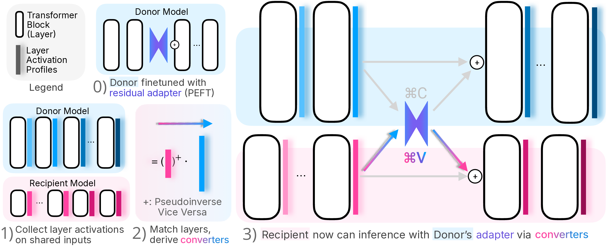

# Command-V: Pasting LLM Behaviors via Activation Profiles

⌘V enables **zero-shot behavioral transfer** across language model architectures using activation profiles. 
Transfer jailbreaking, anti-jailbreaking and reasoning behaviors across different models with little data and no backpropagation.




## ⌘ Key Features

- **Zero Fine-tuning**: No backpropagation. Pure activation-based transfer without backpropagation
- **Fast**: Minimal computational overhead during inference
- **Cross-Family**: In certain conditions, works between Llama, Qwen, Gemma, and other model families


## 🪧 Demo

Check out the complete pipeline ([./command_v_demo.ipynb](https://github.com/GithuBarry/Command-V/blob/main/command_v_demo.ipynb)) or on Colab:
[](https://colab.research.google.com/github/GithuBarry/Command-V/blob/main/command_v_demo.ipynb)


## 🎯 Quick Start

### Installation

```bash
git clone https://github.com/GithuBarry/Command-V.git
cd Command-V
pip install -r requirements.txt
```

### Three-Step Pipeline
```bash
# Profile models on LIMA dataset (once per model)
python step1_capture_activations.py --models meta-llama/Llama-3.2-1B-Instruct meta-llama/Llama-3.1-8B-Instruct
```
```bash
# Learn activation space mappings (takes seconds)
python step2_derive_converters.py derive \
  --source-model meta-llama/Llama-3.1-8B-Instruct \
  --target-model meta-llama/Llama-3.2-1B-Instruct
```
```bash
# Transfer behaviors during inference
python step3_commandv_inference.py \
  --recipient-model meta-llama/Llama-3.2-1B-Instruct \
  --donor-model meta-llama/Llama-3.1-8B-Instruct \
  --adapter-folder reft-adapters/jailbreak/Llama-3.1-8B-Instruct/NodireftIntervention/l1/walledai--AdvBench/L0;2;4;6;8;10;12;14;16;18;20;22;24;26;28;30 \
  --input-source prompts/AdvBench/test.txt \
  --first-n 5 --print-output-only
```

## 🧠 How ⌘V Works

Command-V transfers the **effect** of interventions across models:

1. **Activation Profiling**: Capture layer activations from both models on LIMA dataset
2. **Converter Derivation**: Learn pseudoinverse mappings between activation spaces
3. **Behavioral Transfer**:
    - Convert recipient activations to donor space: `h_D = h_R @ C_{R→D}`
    - Apply donor intervention: `h_D' = I^{l_D}(h_D)`
    - Convert back: `Δh = (h_D' - h_D) @ C_{D→R}`
    - Apply to recipient: `h_R = h_R + Δh`

## 📁 Project Structure

```
├── command_v_demo.ipynb         # Jupyter Demo
├── step1_capture_activations.py # Step 1: Activation profiling
├── step2_derive_converters.py   # Step 2: Converter derivation  
├── step3_commandv_inference.py  # Step 3: Behavioral transfer
├── commandv/                    # Core library
│   ├── core/                    # Main functionality
│   │   ├── capture.py           # Activation capture
│   │   ├── converters.py        # Pseudoinverse converters
│   │   └── inference.py         # Inference engine
│   ├── utils/                   # Utilities
│   └── data/                    # Data processing
├── outputs/                     # Generated files
│   ├── activations/             # Model activation profiles
│   ├── converters/              # Converter mappings (not by default)
│   └── inferences/              # Results
└── reft-adapters/               # Trained behavior adapters
```


## 📄 License

This project is licensed under the MIT License - see the [LICENSE](LICENSE) file for details.
Certain artifacts are further gated for their potential to be abused.
